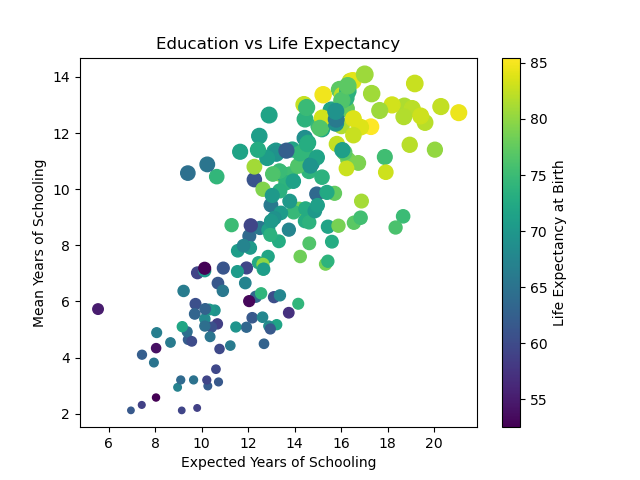
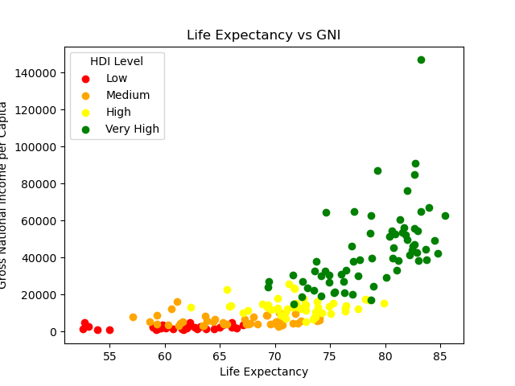
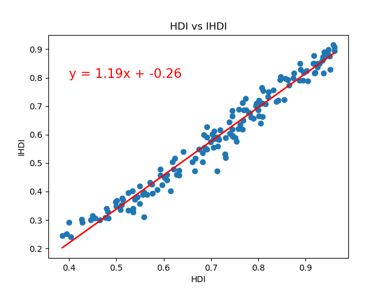
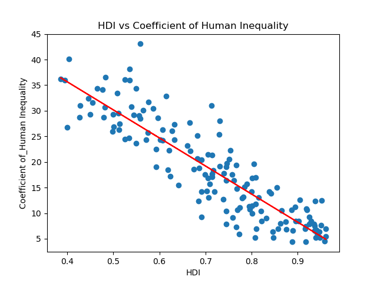
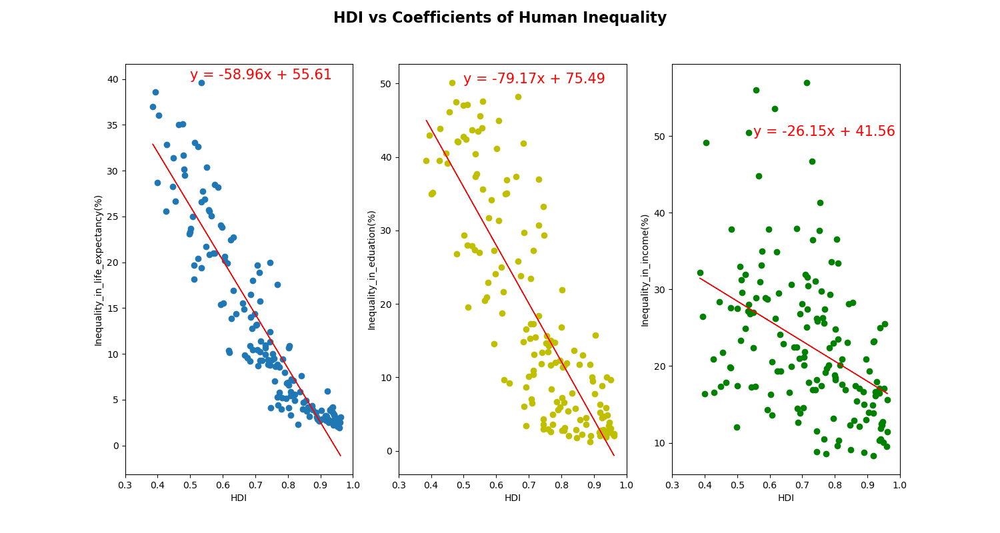
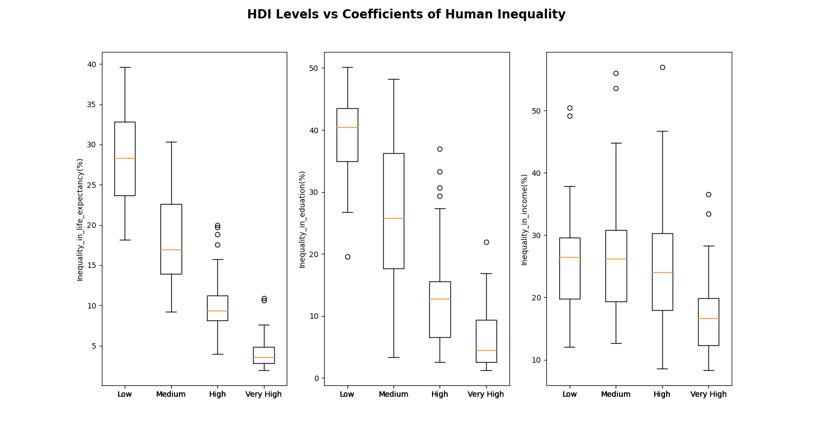
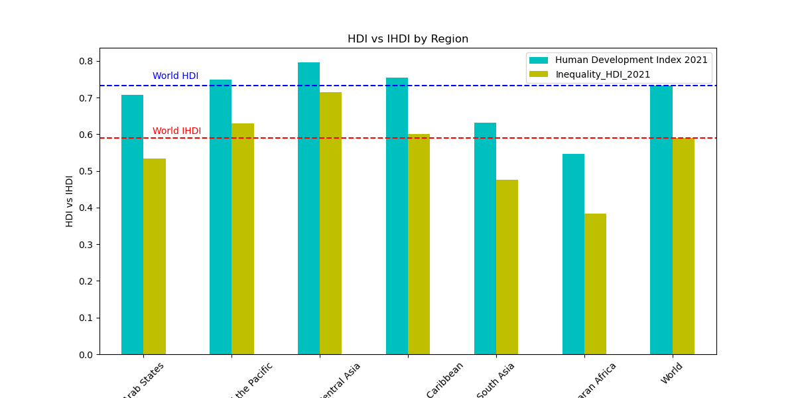
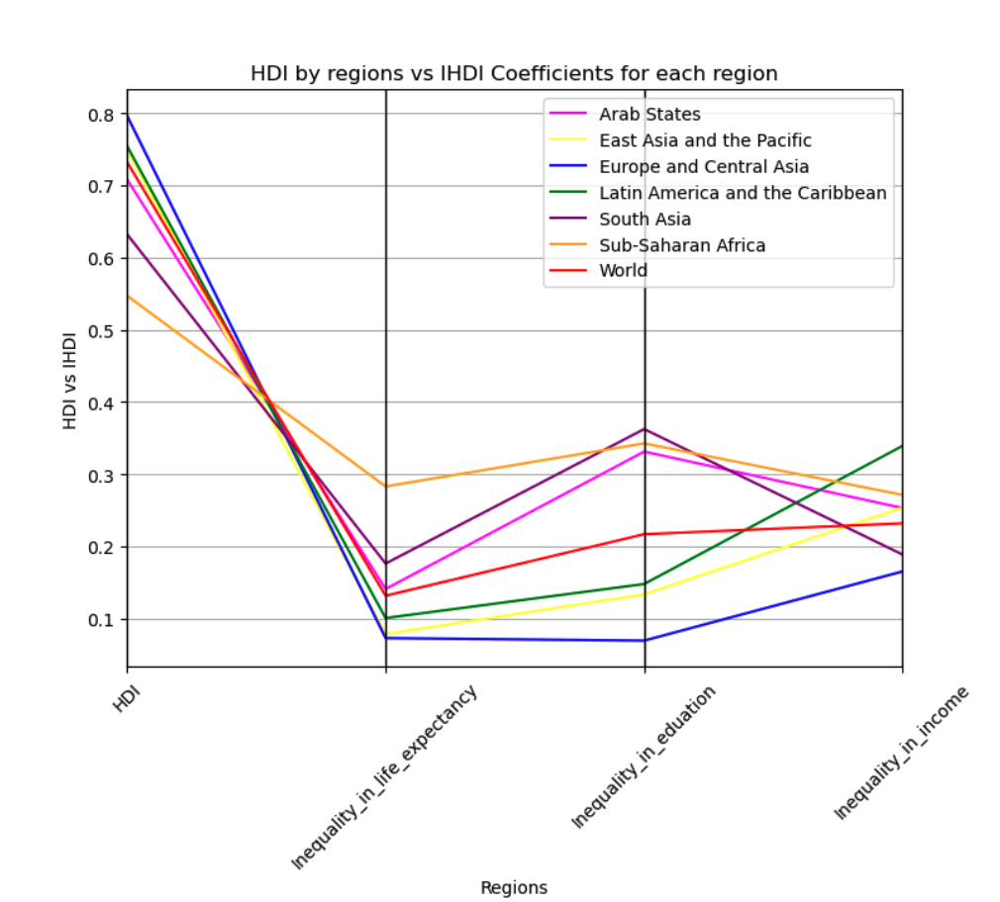

# project-3
UNC Chapel Hill - Data Analytics Boot Camp Project 3

## Team Members:
- Sophia Porretta
- Akhil Karandikar
- Nathaniel Hermann
- Abdulla Mashaly

## Table of Contents

- [About](#about)
- [Data Processing and Cleaning](#dataprocessingandcleaning)
- [Analysis](#analysis)
- [HDI Dashboard](#hdidashboard)
- [HDI Dashboard Backend](#hdidashboardbackend)
- [Contributing](#contributing)
- [Soures](#sources)

## About

The UNDP publishes data available to the public to access specific indicies on Human Development over the years. The data our group used, investigated a few different published indicies and their components for the years 2011-2021. These indicies include the human development index (HDI), the inequality-adjusted HDI (IHDI) the gender inequality index (GII) and the gender human development index (GDI). 
The Human Development Index, for example, is a standardized metric used to measure the development of individual countries or regions and be able to compare them to one another on a single scale. The HDI is comprised of 4 components to help establish a HDI ranking for the country (0-1). The four components that go into calculating an HDI score are the life expectancy of an individual in a country at the time of birth, the expected number of years of school, the mean number of years of school, and the gross national income per capita.
### Definitions																									

- **Human Development Index (HDI):** A composite index measuring average achievement in three basic dimensions of human development—a long and healthy life, knowledge and a decent standard of living.																		
- **Life expectancy at birth:** Number of years a newborn infant could expect to live if prevailing patterns of age-specific mortality rates at the time of birth stay the same throughout the infant’s life.																									
- **Expected years of schooling:** Number of years of schooling that a child of school entrance age can expect to receive if prevailing patterns of age-specific enrolment rates persist throughout the child’s life.																									
- **Mean years of schooling:** Average number of years of education received by people ages 25 and older, converted from education attainment levels using official durations of each level.																									
- **Gross national income (GNI) per capita:** Aggregate income of an economy generated by its production and its ownership of factors of production, less the incomes paid for the use of factors of production owned by the rest of the world, converted to international dollars using PPP rates, divided by midyear population.
- **Inequality-adjusted HDI (IHDI):** HDI value adjusted for inequalities in the three basic dimensions of human development.
- **Inequality in life expectancy:** Inequality in distribution of expected length of life based on data from life tables estimated using the Atkinson inequality index.
- **Inequality in education:** Inequality in distribution of years of schooling based on data from household surveys estimated using the Atkinson inequality index.
- **Inequality in income:** Inequality in income distribution based on data from household surveys estimated using the Atkinson inequality index.

The objective is to use the data to create a web based visual for users to investigate the metrics for individual countries or regions in a comprehensive, easy to follow way. We also performed our own analysis on the data to draw conclusions around the information provided to us from this report. The analysis performed helps to validate the accuracy of the calculations used for these metrics.

## Data Processing and Cleaning

Data was imported to HDI_Cleaning.ipynb and cleaned having all na values removed and the data was exported to csv files. The cleaned data was then imported to MongoDB and the data was served using Flask. The data was then used to create the visualizations and the dashboard.

## Analysis

Is there a relationship between components of the HDI index?

Looking into the HDI components around education and life expectancy we can see a clear relationship between the expected number years of school vs the mean number years of school in each country. We can see from the graph that the countries with more years of schooling are also the countries with the higher life expectancy at the time of birth. This visual acts as quanitative data to support HDI index calculations, suggesting that the more developed countries (the countries with a higher hdi index) are also the countries that are expected to be more educated and live the longest lives.

When comparing the life expectancy in each of the different levels of developing countries to the gross national income made per capita, we can see a wider spread in both categories of the developed countries (in green) then we do in any of the other levels. This graph can give us a clear picture of the diversity in the highly developed countries compared to the lack of diversity in the least developed countries. We can conclude that in the countries with highest income levels, we recognize the longest life expectancy. We also see that in the countries with a higher life expectancy, there is an exponential growth in the GNI per capita that people earn within that country.

---
### HDI vs IHDI Analysis

#### Across Countries:

**1. HDI and IHDI Relationship:**

A comprehensive analysis was conducted to understand the correlation between HDI and IHDI. A correlation coefficient of **0.98** was observed, which was visualized using a scatter plot, with an annotated line equation. Though there's a strong relationship between HDI and IHDI, it's not indicative of higher HDI causing reduced inequality. Thus, we delved into the correlation between HDI and the coefficient of human inequality.

**2. HDI and Coefficient of Human Inequality:**

A correlation analysis on HDI vs Coefficient of inequality yielded a coefficient of **-0.89**. Though the scatter plot depicted a strong negative relationship, anomalies were observed. This necessitated a more detailed analysis, focusing on the components of HDI.

**3. HDI vs Coefficient of Inequality in HDI Components:**

Facet plots provided insights into the correlation between HDI and:
- Inequality in Life Expectancy: **-0.92** (strong negative relationship)
- Inequality in Education: **-0.83** (strong negative relationship)
- Inequality in Income: **-0.41** (moderate negative relationship)

This highlighted that high HDI often aligns with high IHDI relative to other countries, but doesn't necessarily mean consistently reduced coefficients of inequality.

**4. Inequality Coefficient vs HDI Levels:**

Facet box plots were used to visualize inequality coefficients across HDI levels (low, medium, high, very high). Notably:
- Higher HDI leads to reduced inequalities in life expectancy and education.
- Inequality in income remains consistent across low to high HDI levels, with very high HDI levels showcasing slightly reduced income inequality.

#### Across Regions:

**1. Regional HDI and IHDI Overview:**

Grouped bar charts compared HDI and IHDI across six developing regions. While East Asia and Pacific, Europe and Central Asia, and Latin America and Caribbean regions surpassed world averages in HDI and IHDI, Arab states, South Asia, and Sub-Saharan Africa lagged behind.

**2. Regional HDI vs IHDI Coefficients:**

Parallel coordinates plots revealed patterns in regional inequalities:
- Regions with superior HDI usually have reduced inequality in life expectancy and education.
- Europe and Central Asia stood out with the highest HDI and the least income inequality. Meanwhile, regions like South Asia and Latin America exhibited mixed trends, highlighting that higher HDI doesn't always correlate with reduced income inequality.

---
## HDI Dashboard

### Overview:

This project presents a Human Development Index (HDI) Dashboard that visualizes various HDI metrics for different countries. Built using HTML, JavaScript, and various libraries, the dashboard allows users to:

- Select specific countries from a dropdown menu.
- View HDI, rank, and level details of the selected country.
- Visualize data through dynamic charts.
- Explore HDI distribution through maps.
- Analyze HDI metrics by region.

### Features:

1. **Dynamic Data Visualization:** Uses Chart.js and Plotly for creating interactive graphs.
2. **Interactive Navigation:** Users can easily navigate between the home, maps, and HDI by regions.
3. **Responsive Design:** The layout is optimized for both desktop and mobile viewports.
4. **Sleek Theme:** Utilizes the Black Dashboard theme for a modern and visually appealing interface.

### Dependencies:

- [jQuery](https://jquery.com/)
- [Bootstrap](https://getbootstrap.com/)
- [D3.js](https://d3js.org/)
- [Chart.js](https://www.chartjs.org/)
- [Plotly.js](https://plotly.com/javascript/)

### Credits:

The theme used for this dashboard is the "Black Dashboard" by Creative Tim. Check it out [here](https://www.creative-tim.com/product/black-dashboard).

---
### JavaScript:
The JS code is in the script.js file. The code is organized into functions that are called when the user interacts with the dashboard.

**Key Sections:**
**1. Data Fetching**
There are two API endpoints from which data is fetched:

- One for regions: `http://127.0.0.1:9500/regions`
- One for countries: `http://127.0.0.1:9500/`

The fetched data is stored in `allDataRegions` and `allData` respectively.

**2. Dropdown for Countries**

A dropdown is created, populated with country names fetched from the API. When a country is selected from this dropdown, the `optionChanged` function is triggered.

**3. Line Chart by Country**

When a country is chosen from the dropdown, its trend over the years for HDI and IHDI is visualized using the `lineChart` function. 

**4. Dashboard Cards**

There are three cards (`#hdi`, `#rank`, and `#level`) that display specific details about a chosen country's HDI for the year 2021.

**5. Radar Chart**

A placeholder function `radar_chart` hints at creating a radar/spider chart for selected country data, though its implementation is not provided.

**6. Line Chart by Regions**

This section processes the fetched regional data and creates a line chart (`lineChartRegion` function) to display trends of HDI and IHDI by region over the years. The colors for the HDI and IHDI lines are defined in the `hdiColors` and `ihdiColors` arrays.

**7. Bar Chart Visualization for Inequalities in HDI Components by Region**

This function, `barChartRegion`, visualizes the inequality percentages for three Human Development Index (HDI) components by regions in a grouped bar chart format.

## HDI Dashboard Backend

### Overview

Our dashboard's backend leverages the power of the Flask framework combined with MongoDB to provide a robust system for serving HDI data. Here's a deep dive into the structure and functionalities.

### Data Storage with MongoDB

We utilize MongoDB for its scalability and flexibility, offering an efficient method to manage large datasets:

    mongod
    mongoimport --type csv -d HDI -c hdi_countries --headerline --drop HDI_countries.csv
    mongoimport --type csv -d HDI -c hdi_regions --headerline --drop HDI_regions.csv
    mongoimport --type csv -d HDI -c hdi_levels --headerline --drop HDI_levels.csv
    mongoimport --type csv -d HDI -c ihdi_countries --headerline --drop IHDI_countries.csv
    mongoimport --type csv -d HDI -c ihdi_regions --headerline --drop IHDI_regions.csv
    mongoimport --type csv -d HDI -c ihdi_levels --headerline --drop IHDI_levels.csv
    mongoimport --type csv -d HDI -c le_countries --headerline --drop le_countries.csv
    mongoimport --type csv -d HDI -c le_regions --headerline --drop le_regions.csv
    mongoimport --type csv -d HDI -c le_levels --headerline --drop le_levels.csv
    mongoimport --type csv -d HDI -c eys_countries --headerline --drop eys_countries.csv
    mongoimport --type csv -d HDI -c eys_regions --headerline --drop eys_regions.csv
    mongoimport --type csv -d HDI -c eys_levels --headerline --drop eys_levels.csv
    mongoimport --type csv -d HDI -c mys_countries --headerline --drop mys_countries.csv
    mongoimport --type csv -d HDI -c mys_regions --headerline --drop mys_regions.csv
    mongoimport --type csv -d HDI -c mys_levels --headerline --drop mys_levels.csv
    mongoimport --type csv -d HDI -c gni_countries --headerline --drop GNI_countries.csv
    mongoimport --type csv -d HDI -c gni_regions --headerline --drop GNI_regions.csv
    mongoimport --type csv -d HDI -c gni_levels --headerline --drop GNI_levels.csv
    mongoimport --type csv -d HDI -c gii_countries --headerline --drop GII_countries.csv
    mongoimport --type csv -d HDI -c gii_regions --headerline --drop GII_regions.csv
    mongoimport --type csv -d HDI -c gii_levels --headerline --drop GII_levels.csv
    mongoimport --type csv -d HDI -c ihdi_index_countries --headerline --drop IHDI_index_countries.csv
    mongoimport --type csv -d HDI -c ihdi_index_regions --headerline --drop IHDI_regions_index.csv
    mongoimport --type csv -d HDI -c ihdi_index_levels --headerline --drop IHDI_levels_index.csv
    mongoimport --type csv -d HDI -c HDI_2021_countries --headerline --drop HDI_2021_countries.csv
    mongoimport --type csv -d HDI -c HDI_2021_regions --headerline --drop HDI_2021_regions.csv
    mongoimport --type csv -d HDI -c HDI_2021_levels --headerline --drop HDI_2021_levels.csv

cd into the csv tables directory and Run the above commands in the terminal or bash for populating the database. 

### Flask & MongoDB Integration

Flask offers a lightweight method to serve data, and with `pymongo`, it smoothly interfaces with MongoDB. The code is in the `flask_app.py` file.

### API Endpoints

We've designed intuitive API endpoints:

- **`/`**:
  Fetches HDI data for countries including the regular HDI, IHDI, and data specifically from the year 2021 and also HDI and IHDI trends from 2011 to 2021 for every country.

- **`/regions`**:
    Fetches HDI data for regions including the regular HDI, IHDI, and data specifically from the year 2021 and also HDI and IHDI trends from 2011 to 2021 for every country.

Each endpoint fetches data from MongoDB, processes the results, and serves them as structured JSON.

### Getting Started

To run the Flask server:

1. Ensure MongoDB is running and you've imported the datasets.
2. Execute the Flask script:

By default, the server will be accessible at `127.0.0.1` on port `9500`.

## Contributing
Charts.js --> This was a library that our group decided to use outside of the libraries we learned about in our class. We used this library to create the radar chart and the line graph to compare the HDI and IHDI
Plotly --> This library was used for our analysis to create static references to support our conclusions.
UNHD --> Public data used from the United Nations Human Development API to build our project around.

## Sources
- [UNDP](http://hdr.undp.org/en/data)
- [Pandas Documentation](https://pandas.pydata.org/docs/)
- [Plotly Documentation](https://plotly.com/python/)
- [Chart.js Documentation](https://www.chartjs.org/docs/latest/)
- [Flask Documentation](https://flask.palletsprojects.com/en/2.0.x/)
- [MongoDB Documentation](https://docs.mongodb.com/)
- [Bootstrap Documentation](https://getbootstrap.com/docs/5.0/getting-started/introduction/)
- [Black Dashboard](https://www.creative-tim.com/product/black-dashboard)
- [D3.js Documentation](https://d3js.org/)
- [Matplotlib Documentation](https://matplotlib.org/stable/contents.html)

